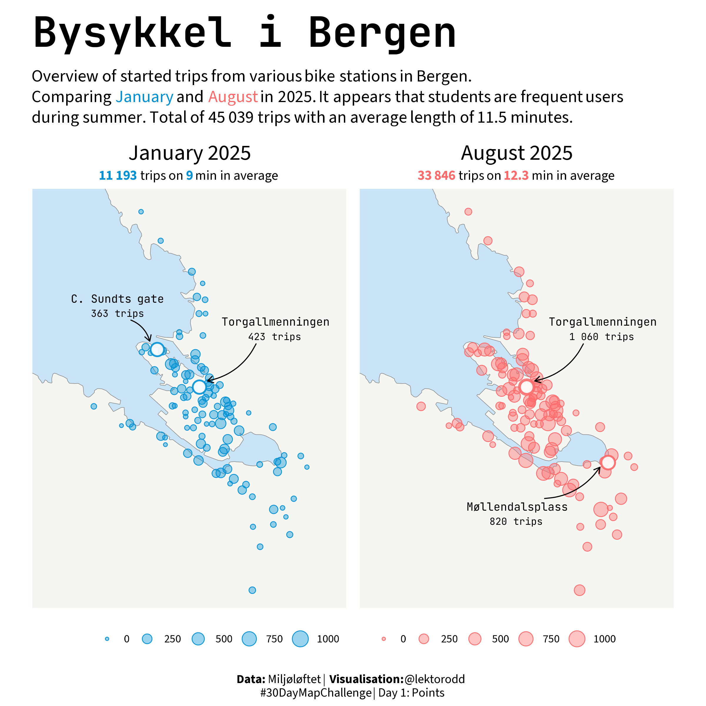

First visualization in R in a loooong time, and first ever R-map. Fun to try and make a few maps this november.

{width=75% fig-align="center"}

::: {.callout-tip collapse="true"}
## Libraries used

```{r setup, message=FALSE, warning=FALSE}
library(ggplot2)
library(sfarrow)
library(sf)
library(readr)
library(dplyr)
library(showtext)
library(ggtext)
library(glue)
library(ggrepel)
library(grid)
library(patchwork)
library(here)
```

:::

## The data

For the first two days i intend to use the open data from the "Bergen Bysykkel" (Bergen City Bikes). Subscription based bike rental, operated by the municipality of Bergen. They offer a lot of open data on their service. Every ride, with start and stop stations, coordinates, time, etc. is availiable [here](https://bergenbysykkel.no/apne-data). 

```{r data, message=FALSE, warning=FALSE}
# Load data
bysykkel_jan25 <- read_csv(here("data/bysykkel/bysykkel-25-01.csv"))
bysykkel_aug25 <- read_csv(here("data/bysykkel/bysykkel-25-08.csv"))
```

## Helper functions

I need a few helper funtions to make the plotting and wrangling easier. 

### Highlight text

```{r highlight-text-fun}
hl_jan <- function(x) glue("<span style='color:{punkt_farge_jan}'>{x}</span>")
hl_aug <- function(x) glue("<span style='color:{punkt_farge_aug}'>{x}</span>")
```

### Count trips

I want to count the trips to and from each station.

```{r count-trips-fun}
stasjonstelling <- function(data) {
    startar <- data |>
        group_by(
          start_station_id, 
          start_station_name, 
          start_station_latitude, 
          start_station_longitude
        ) |>
        summarise(turar_starta = n(), .groups = "drop")
    
    sluttar <- data |>
        group_by(
          end_station_id, 
          end_station_name, 
          end_station_latitude, 
          end_station_longitude
        ) |>
        summarise(turar_slutta = n(), .groups = "drop")
    
    stasjonar <- full_join(
        startar, sluttar,
        by = c("start_station_id" = "end_station_id",
               "start_station_name" = "end_station_name")
    ) |>
        rename(
            station_id = start_station_id,
            station_name = start_station_name,
            latitude = start_station_latitude,
            longitude = start_station_longitude
        ) |>
        select(station_id, station_name, latitude, longitude, turar_starta, turar_slutta)
}
```

### Some arrows

This is an AI-assisted function, and I am willing to bet quite a lot it could be done simpler and better... But not time to figure it out now. Baby steps. 

```{r arrow-fun}
pil_etikett <- function(pt, lx, ly, color,
                        curvature = 0.25,
                        font = "jbmono",
                        name_size_pt = 9,
                        value_size_pt = 8,
                        text_colour = "black",
                        show_halo = TRUE,
                        pad_start = 0.005,
                        pad_end   = 0.003) {

  stopifnot(nrow(pt) == 1)

  # Berekn retningsvektor for pila (for padding)
  dx <- pt$longitude - lx
  dy <- pt$latitude - ly
  dist <- sqrt(dx^2 + dy^2)
  ux <- dx / dist
  uy <- dy / dist

  # Juster start- og sluttposisjon
  x_start <- lx + ux * pad_start
  y_start <- ly + uy * pad_start
  x_end   <- pt$longitude - ux * pad_end
  y_end   <- pt$latitude - uy * pad_end
  
    list(
    # Valfri liten halo rundt sjølve punktet
    if (show_halo)
      geom_point(
        data = pt, aes(longitude, latitude),
        shape = 21, fill = "white", alpha=0.9,color = color, size = 4.5, stroke = 1
      ),

    # Boga pil frå tekst til punkt
    geom_curve(
      data = pt,
      inherit.aes = FALSE,
      aes(x = x_start, y = y_start, xend = x_end, yend = y_end),
      curvature = curvature, linewidth = 0.4, colour = "black",
      arrow = arrow(length = unit(2, "mm"), type = "open")
    ),

    # Tekst utan bakgrunn (berre tekst)
    ggtext::geom_richtext(
      data = data.frame(lx = lx, ly = ly,
                        station_name = pt$station_name,
                        turar_starta = pt$turar_starta),
      inherit.aes = FALSE,
      aes(lx, ly,
          label = glue::glue(
            "<span style='font-size:{name_size_pt}pt'>{station_name}</span><br/>
             <span style='font-size:{value_size_pt}pt'>{format(turar_starta, big.mark = ' ')} trips</span>"
          )),
      family = font, colour = "black",
      fill = NA, label.color = NA, label.padding = unit(c(0,0,0,0), "pt"),
      lineheight = 1.06
    )
  )
}
```

## Data wrangling

```{r data-wrangling, warning=FALSE, message=FALSE}
stasjonar_jan25 <- stasjonstelling(bysykkel_jan25)
stasjonar_aug25 <- stasjonstelling(bysykkel_aug25)

# Fun facts
total_turar_jan25 <- nrow(bysykkel_jan25)
snittlengd_turar_jan25 <- mean(bysykkel_jan25$duration) / 60 
total_turar_aug25 <- nrow(bysykkel_aug25)
snittlengd_turar_aug25 <- mean(bysykkel_aug25$duration) / 60

total_turar <- total_turar_jan25 + total_turar_aug25
total_snitt <- mean(c(bysykkel_jan25$duration, bysykkel_aug25$duration)) / 60

# Find top stations for labeling - january
pt1_jan <- stasjonar_jan25 |> dplyr::slice_max(turar_starta, n = 1)
pt2_jan <- stasjonar_jan25 |> dplyr::slice_max(turar_starta, n = 2) |> dplyr::slice(2)

# Find top stations for labeling - august
pt1_aug <- stasjonar_aug25 |> dplyr::slice_max(turar_starta, n = 1)
pt2_aug <- stasjonar_aug25 |> dplyr::slice_max(turar_starta, n = 2) |> dplyr::slice(2)
```

## Map - setup

Some setups. Starting with fonts, colors and text. 

```{r map-setup-1}
# Fonts
font_add_google("Source Sans 3", "sourcesans")
font_add_google("JetBrains Mono", "jbmono")
showtext_auto()
showtext_opts(dpi = 300)

body_font <- "sourcesans"
title_font <- "jbmono"

# Colors
land_farge = "#f5f5f2"
sjø_farge = "#c9e4f6"
grense_farge = "#8a8a8a"
punkt_farge_jan = "#0091D5"
punkt_farge_aug = "#ff6b6b"

# Text
title = "Bysykkel i Bergen"
caption = "**Data:** Miljøløftet | **Visualisation:** @lektorodd <br>#30DayMapChallenge | Day 1: Points"
subtitle <- glue("Overview of started trips from various bike stations in Bergen. <br>Comparing {hl_jan('January')} and {hl_aug('August')} in 2025. It appears that students are frequent users during summer. Total of {format(total_turar, big.mark = ' ')} trips with an average length of {round(total_snitt, 1)} minutes.")
```

## Base map

Start with reading some spatial data for Bergen.

```{r map-setup-2, message=FALSE, warning=FALSE}
bergen <- st_read_parquet(here("data/Kommuner.parquet")) |>
    filter(navn == "Bergen") |>
    st_set_crs(25833) |>
    st_transform(4326)
```

Then set some borders
```{r map-setup-3}
xlim_vals <- c(5.27, 5.37)
ylim_vals <- c(60.358, 60.424)
```

Then make a list to plot the basemap.

```{r base-map}
#| dpi: 300
#| fig.height: 8
#| fig.width: 8
#| dev: "png"
#| warning: false
#| message: false
basekart <- list(
    geom_sf(data = bergen, fill = land_farge, color = grense_farge),
    coord_sf(xlim = xlim_vals, ylim = ylim_vals),
    theme(
        plot.title = element_text(
            family = title_font,
            size = 32,
            face = "bold",
            hjust = 0.5,
            margin = margin(b = 15)
        ),
        plot.subtitle = element_textbox_simple(
            family = body_font,
            size = 12,
            halign = 0.5,
            margin = margin(b = 10),
        ),
        plot.caption = element_text(
            family = title_font,
            size = 10,
            hjust = 0.5,
            margin = margin(t = 10)
        ),
        legend.text = element_text(
            family = body_font,
            size = 9
        ),
        legend.position = "bottom",
        legend.key = element_blank(),
        panel.background = element_rect(fill = sjø_farge),
        panel.grid = element_blank(),
        axis.title = element_blank(),
        axis.text = element_blank(),
        axis.ticks = element_blank()
    )
)


```

And some functions for plotting points

```{r point-plot-fun}
punkt_lag <- function(data, farge) {
    list(
        geom_point(
            data = data,
            aes(x = longitude, y = latitude, size = turar_starta),
            color = farge,
            alpha = 0.4
        ) ,
        geom_point(
            data = data,
            aes(x = longitude, y = latitude, size = turar_starta),
            shape = 21,
            fill = NA,
            color = farge,
            stroke = 0.4
        )
    )
}
```


And finally ready to make the fun mapping. 

## Map - plotting

```{r map-plotting-fun, warning=FALSE, message=FALSE}
#| dpi: 300
#| fig.height: 8
#| fig.width: 8
#| dev: "png"

# Function to make the maps
lag_bysykkel_kart <- function(data, farge, tittel, total_turar, snittlengd, max_turar, hl_funksjon) {
    ggplot() +
        basekart +
        punkt_lag(data, farge) +
        labs(
            title = tittel,
            subtitle = glue("**{hl_funksjon(format(total_turar, big.mark = ' '))}** trips on **{hl_funksjon(round(snittlengd, 1))}** min in average"),
            size = ""
        ) +
        scale_size_continuous(range = c(1, 6), limits = c(0, max_turar)) +
        theme(
            plot.subtitle = element_markdown(
                family = body_font, 
                size = 11, 
                halign = 0.5, 
                margin = margin(b = 5), 
                lineheight = 1.1
            ),
            plot.title = element_text(
                family = body_font, 
                face = "plain", 
                size = 18, 
                margin = margin(b = 5)
            )
        )
}

# Common max for size scaling
max_turar <- max(c(stasjonar_jan25$turar_starta, stasjonar_aug25$turar_starta))
```

Now make the two maps

```{r make-maps, warning=FALSE, message=FALSE}
# Map for january
p_jan <- lag_bysykkel_kart(
    data = stasjonar_jan25,
    farge = punkt_farge_jan,
    tittel = "January 2025",
    total_turar = total_turar_jan25,
    snittlengd = snittlengd_turar_jan25,
    max_turar = max_turar,
    hl_funksjon = hl_jan
)

# Map for august
p_aug <- lag_bysykkel_kart(
    data = stasjonar_aug25,
    farge = punkt_farge_aug,
    tittel = "August 2025",
    total_turar = total_turar_aug25,
    snittlengd = snittlengd_turar_aug25,
    max_turar = max_turar,
    hl_funksjon = hl_aug
)
```

## Map - annotations

```{r}
# Add annotations to january-map
p_jan <- p_jan +
  pil_etikett(pt1_jan, lx = 5.35, ly = 60.403, color = punkt_farge_jan, curvature = -0.25, pad_start=0.007) +
  pil_etikett(pt2_jan, lx = 5.295, ly = 60.407, color = punkt_farge_jan, curvature =  -0.25)

# Add annotations to august-map
p_aug <- p_aug +
  pil_etikett(pt1_aug, lx = 5.35, ly = 60.403, color = punkt_farge_aug, curvature = -0.25, pad_start = 0.007) +
  pil_etikett(pt2_aug, lx = 5.32, ly = 60.371, color = punkt_farge_aug, curvature =  0.25, pad_start=0.01)
```

## Final plot

Using patchwork to combine the two maps and add title, subtitle and caption.

```{r final-plot, dpi=300, fig.height=8, fig.width=8, dev="png", warning=FALSE, message=FALSE}
plot_patch <- p_jan + p_aug +
    plot_layout(ncol = 2, guides = "collect") &
    theme(legend.position = "bottom")

ferdig_plott <- plot_patch +
    plot_annotation(
        title = title,
        subtitle = subtitle,
        caption = caption,
        theme = theme(
            plot.title = element_text(
                family = title_font,
                size = 34,
                face = "bold",
                hjust = 0,
                margin = margin(b = 8, t=8)
            ),
            plot.subtitle = element_textbox_simple(
                family = body_font,
                size = 14,
                halign = 0,
                margin = margin(b = 10, t=5)
            ),
            plot.caption = element_markdown(
                family = body_font,
                size = 10,
                hjust = 0.5,
                lineheight = 1.1,
                margin = margin(t = 10)
      )
    )
)

ferdig_plott
```

```{r, include=FALSE}
# Save final plot
ggsave(
    filename = here("30DayMapChallenge/2025/2025-1-points/day1-points.png"),
    plot = ferdig_plott,
    width = 8,
    height = 8,
    dpi = 300
)
```
