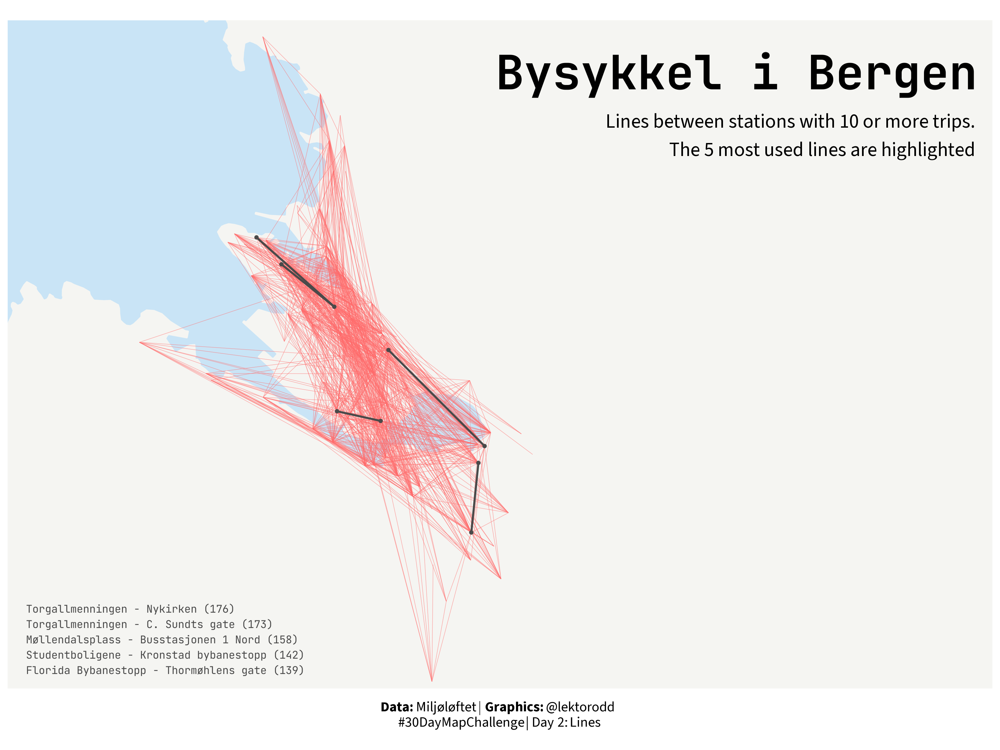

Second map in the series (and ever...). Hoping to use the same data and basemap-style as yesterday, but try to visualize the trips themselves as lines. 

{width=75% fig-align="center"}

::: {.callout-tip collapse="true"}
## Libraries used

```{r, warning=FALSE, message=FALSE}
library(ggplot2)
library(tidyr)
library(sfarrow)
library(sf)
library(readr)
library(dplyr)
library(showtext)
library(ggtext)
library(glue)
library(here)
```

:::

## Data

Same data and source as [yesterday](../2025-1-points/index.qmd)

```{r data-bike-map, warning=FALSE, message=FALSE}
# Load bikerides 
turar <- read_csv(here("data/bysykkel/bysykkel-25-08.csv"))

# Load spatial data
bergen <- st_read_parquet(here("data/Kommuner.parquet"))|>
    filter(navn == "Bergen") |>
    st_set_crs(25833) |>
    st_transform(4326)

# Boundaries
xlim_vals <- c(5.27, 5.44)
ylim_vals <- c(60.36, 60.417)
```

## Setup

Choose some fonts, colors and text for titles. 

```{r setup-bike-map, warning=FALSE, message=FALSE}
# Fonts
font_add_google("Source Sans 3", "sourcesans")
font_add_google("JetBrains Mono", "jbmono")
showtext_auto()
showtext_opts(dpi = 300)

body_font <- "sourcesans"
title_font <- "jbmono"

# Colors
land_farge = "#f5f5f2"
sjø_farge = "#c9e4f6"
grense_farge = "#8a8a8a"
stasjon_farge = "#0091D5"
linje_farge = "#ff6b6b"
utheving_farge = "#4a4a4a"

# Text
tittel <- "Bysykkel i Bergen"
subtittel <- "Lines between stations with 10 or more trips.\nThe 5 most used lines are highlighted"
caption <- "**Data:** Miljøløftet | **Graphics:** @lektorodd <br>#30DayMapChallenge | Day 2: Lines"
```

## Data wrangling

As you may have read between the lines (...) in the subtitle above, there are a lot of different trips in the dataset. But first we have to get the different trips. I dont care about direction, so a trip from station A to B is the same as from B to A.

The data contains one row per trip: 

```{r trip-number, warning=FALSE, message=FALSE}
nturar <- nrow(turar)

nturar
```

For August 2025 there were a total of 33 846 trips with the city bikes. Quite impressive for a small and hilly city like Bergen!

There were some trips starting and ending at the same station: 

```{r same-station-trips, warning=FALSE, message=FALSE}
lik_start_slutt <- turar |>
  filter(start_station_id == end_station_id) |>
  nrow()

lik_start_slutt
```


### List of stations
```{r station list, warning=FALSE, message=FALSE}
stasjonsliste <- turar |>
  select(
    start_station_id,
    start_station_name,
    start_station_latitude,
    start_station_longitude
  ) |>
  distinct(start_station_id, .keep_all = TRUE) |> 
  rename(
    station_id = start_station_id,
    station_name = start_station_name,
    latitude = start_station_latitude,
    longitude = start_station_longitude) |> 
  select(station_id, station_name, latitude, longitude)
```

### Trips

So, we need to exclude the trips going to and from the same station. Also we need to see the conncetions from A to B the same as from B to A. Will use the station id number to fix this. 

```{r trip-list, warning=FALSE, message=FALSE}
# filter out the loops
turar_mellom <- turar |> 
  filter(start_station_id != end_station_id)

# trips between stations, ignoring direction
turar_par <- turar_mellom |> 
  mutate(
    station_1 = pmin(start_station_id, end_station_id),
    station_2 = pmax(start_station_id, end_station_id)
  ) |> 
  group_by(station_1, station_2) |> 
  summarise(
    n_turar = n(),
    .groups = "drop"
  )
```

Then add coordinates for the stations:
```{r trip-coords, warning=FALSE, message=FALSE}
# Adding coordinates for station_1
turar_par_koord <- turar_par |> 
  left_join(
    stasjonsliste, 
    by = c("station_1" = "station_id")
  ) |> 
  rename(
    lon_1 = longitude,
    lat_1 = latitude,
    name_1 = station_name
  )

# Adding coordinates for station_2
turar_par_koord <- turar_par_koord |> 
  left_join(
    stasjonsliste, 
    by = c("station_2" = "station_id")
  ) |> 
  rename(
    lon_2 = longitude,
    lat_2 = latitude,
    name_2 = station_name
  )
```

Finally, I want to calculate the top connections. 

```{r top-trips, warning=FALSE, message=FALSE}
# Find the top 5 trips
topp_turar <- turar_par_koord |> 
  slice_max(n_turar, n = 5)

# Get the stations involved in the top trips
topp_stasjoner <- stasjonsliste |>
  filter(station_id %in% c(topp_turar$station_1, topp_turar$station_2))

# Prepare text for the top routes
topp_ruter_tekst <- topp_turar |>
  mutate(
    rute_linje = glue("{name_1} - {name_2} ({n_turar})")
  ) |>
  pull(rute_linje) |> 
  paste(collapse = "\n")
```

## Plotting

First I will plot a basemap, then gradually build a plot on top of that. 

### Basemap

```{r basemap, warning=FALSE, message=FALSE}
basekart <- ggplot() +
    geom_sf(data = bergen, fill = land_farge, color = NA) +
    coord_sf(xlim = xlim_vals, ylim = ylim_vals) +
    theme(
        plot.title = element_text(
            family = title_font,
            size = 32,
            face = "bold",
            hjust = 0.5,
            margin = margin(b = 15)
        ),
        plot.subtitle = element_textbox_simple(
            family = body_font,
            size = 12,
            halign = 0.5,
            margin = margin(b = 10),
        ),
        legend.text = element_text(
            family = body_font,
            size = 9
        ),
        legend.position = "bottom",
        legend.key = element_blank(),
        panel.background = element_rect(fill = sjø_farge),
        panel.grid = element_blank(),
        axis.title = element_blank(),
        axis.text = element_blank(),
        axis.ticks = element_blank()
    )

basekart
```

### Adding lines

```{r lines-map, warning=FALSE, message=FALSE}
plott <- basekart + 
  geom_segment(
    data = filter(turar_par_koord, n_turar > 9),
    aes(x = lon_1, y = lat_1, xend = lon_2, yend = lat_2),
    color = linje_farge,
    linewidth = 0.15,
    alpha = 0.6,
  )

plott
```

### Highlight top lines

```{r highlight-lines-map, warning=FALSE, message=FALSE}
plott <- plott +
  geom_segment(
    data = topp_turar,
    aes(x = lon_1, y = lat_1, xend = lon_2, yend = lat_2),
    color = utheving_farge,
    linewidth = 0.7,
    lineend = "round"
  )

plott <- plott +
  geom_point(
    data = topp_stasjoner,
    aes(x = longitude, y = latitude),
    color = utheving_farge,
    size = 0.8,
    alpha = 1
  )

plott
```

### Finalize plot with titles and caption

```{r finalize-map, dpi=300, fig.height=7.5, fig.width=10, dev="png", warning=FALSE, message=FALSE}
plott <- plott +
  annotate(
    "text",
    x = 5.445,
    y = 60.415,
    label = tittel,
    family = title_font,
    size = 12,
    fontface = "bold",
    hjust = 1,
  ) + 
  annotate(
    "text",
    x = 5.445,
    y = 60.411,
    family = body_font,
    size = 5,
    hjust = 1,
    vjust = 1,
    label = subtittel,
  ) 

plott <- plott +
  annotate(
    "text",
    x = 5.265,
    y = 60.365,
    color = utheving_farge,
    label = topp_ruter_tekst,
    family = title_font,
    size = 2.7,
    hjust = 0,
    vjust = 1,
    lineheight = 1.2,
  )

plott <- plott +
  labs(
    caption = caption
  ) + 
  theme(
    plot.caption = element_markdown(
      family = body_font,
      size = 10,
      hjust = 0.5,
      lineheight = 1.1,
      margin = margin(t = 10))
  )

plott
```


```{r, include=FALSE}
# Save final plot
ggsave(
    filename = here("30DayMapChallenge/2025/2025-2-lines/day2-lines.png"),
    plot = plott,
    width = 10,
    height = 7.5,
    dpi = 300
)
```