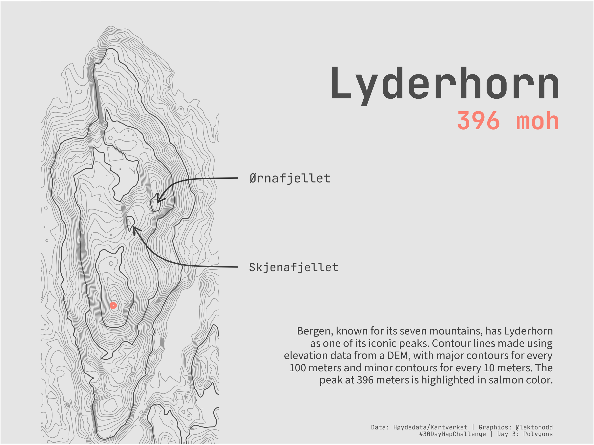

Trying a different approach today. Using elevation data from a DEM to create contour polygons for a mountain in Bergen, Norway called Lyderhorn (396 meters above sea level).

{width=75% fig-align="center"}


::: {.callout-tip collapse="true"}
## Libraries used

```{r, warning=FALSE, message=FALSE}
library(ggplot2)
library(terra)
library(sf)
library(dplyr)
library(here)
library(smoothr)
library(cowplot)
library(showtext)
library(grid)
```

:::


```{r}
dem <- rast(here("data/lyderhorn/data/dom1-33-104-120.tif"))
```


```{r plot-1, fig.width=8, fig.height=6, dpi=300, dev='png'}
# Create all contours at 10m intervals (including 1m to avoid sea)
all_levels <- c(1, seq(10, 400, by = 10))

all_contours_raw <- as.contour(dem, levels = all_levels) |> 
  st_as_sf() |> 
  mutate(elevation = as.numeric(level))

# Smooth all contours
all_contours <- smooth(all_contours_raw, method = "chaikin", refinements = 5) |> 
  st_transform(4326)

# Separate into major (100, 200, 300, 400) and minor (everything else)
major_contours <- all_contours |> 
  filter(elevation %in% c(100, 200, 300, 400))

minor_contours <- all_contours |> 
  filter(!elevation %in% c(100, 200, 300, 400))

# Plot with lat/lon coordinates
p <- ggplot() +
  geom_sf(data = minor_contours, color = "grey60", size = 0.25) +
  geom_sf(data = major_contours, color = "grey30", size = 0.4) +
  geom_sf(data = all_contours |> filter(elevation == max(elevation)), 
    color = "salmon", size = 2) +
  coord_sf(xlim = c(5.23, 5.26), ylim = c(60.363, 60.40)) +
  theme(
    panel.grid = element_blank(),
    axis.text = element_blank(),
    axis.ticks = element_blank(),
    axis.title = element_blank(),
    plot.background = element_rect(fill = "gray90"),
    panel.background = element_rect(fill = "gray90"),
    plot.margin = margin(0, 365, 0, 40)
  )

print(p)
```

## Add some text

Here I will try to use the `cowplot` library to add some text to the plot. 

```{r plot-2, fig.width=8, fig.height=6, dpi=300, dev='png'}
title = "Lyderhorn"
subtitle = "396 moh"

font_add_google("JetBrains Mono", "jbmono")
font_add_google("Source Sans 3", "sourcesans")
showtext_auto()
showtext_opts(dpi = 300)

title_font <- "jbmono"
body_font <- "sourcesans"

# title
p <- ggdraw(p) +
  draw_label(
    title,
    x = 0.94, y = 0.85,
    hjust = 1, vjust = 1,
    color = "grey30", size = 42, fontfamily = title_font, fontface = "bold"
  ) +
  draw_label(
    subtitle,
    x = 0.94, y = 0.75,
    hjust = 1, vjust = 1,
    color = "salmon", size = 24, fontfamily = title_font, fontface= "bold"
  )

print(p)
```


```{r plot-3, fig.width=8, fig.height=6, dpi=300, dev='png'}
# Create a curved arrow grob
ørnafjellet <- curveGrob(
  x1 = 0.4, y1 = 0.6,
  x2 = 0.265, y2 = 0.545,
  curvature = 0.2,
  arrow = arrow(length = unit(0.3, "cm"), type = "open"),
  gp = gpar(col = "gray20", lwd = 1.75)
)

skjenafjellet <- curveGrob(
  x1 = 0.4, y1 = 0.4,
  x2 = 0.225, y2 = 0.49,
  curvature = -0.2,
  arrow = arrow(length = unit(0.3, "cm"), type = "open"),
  gp = gpar(col = "gray25", lwd = 1.75)
)

p <- ggdraw(p) +
  draw_grob(ørnafjellet) + 
  draw_grob(skjenafjellet) +
  draw_label(
    "Ørnafjellet",
    x = 0.42, y = 0.60,
    hjust = 0, vjust = 0.5,
    color = "gray25", size = 12, fontfamily = title_font
  ) +
  draw_label(
    "Skjenafjellet",
    x = 0.42, y = 0.40,
    hjust = 0, vjust = 0.5,
    color = "gray25", size = 11, fontfamily = title_font
  ) + 
  draw_label(
    "Bergen, known for its seven mountains, has Lyderhorn \nas one of its iconic peaks. Contour lines made using \nelevation data from a DEM, with major contours for every \n100 meters and minor contours for every 10 meters. The \npeak at 396 meters is highlighted in salmon color.",
    x = 0.93, y = 0.265,
    hjust = 1, vjust = 1,
    color = "gray25", size = 11, fontfamily = body_font
  ) +
  draw_label(
    "Data: Høydedata/Kartverket | Graphics: @lektorodd \n#30DayMapChallenge | Day 3: Polygons",
    x = 0.93, y = 0.02,
    hjust = 1, vjust = 0,
    color = "gray30", size = 6, fontfamily = title_font
  )
print(p)
```


```{r, include=FALSE}
# Save final plot
ggsave(
    filename = here("30DayMapChallenge/2025/2025-3-polygons/day3-polygons.png"),
    plot = p,
    width = 8,
    height = 6,
    dpi = 300
)
```